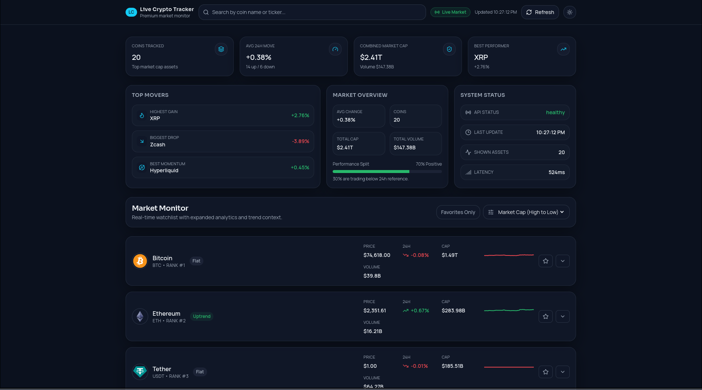
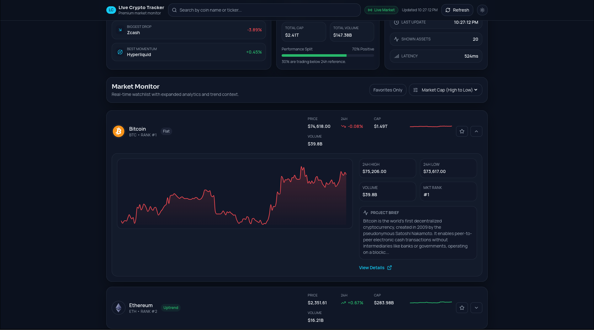

<div align="center">
  <h1>Live Crypto Tracker</h1>
  <p><i>A real-time crypto market dashboard built with React, TypeScript, and a scalable front-end architecture</i></p>

  <p>
    
    
    
    
    
  </p>
</div>

---

## Overview

**Live Crypto Tracker** is a front-end application focused on fast market monitoring and clear decision support.

It fetches top assets by market cap from CoinGecko, applies client-side analytics, and presents a responsive dashboard with watchlist workflows, trend context, and polished system states.

The project prioritizes:

- clean separation between UI, hooks, services, and data helpers;
- reusable components and predictable design tokens;
- responsive UX with light/dark theming;
- low-friction local setup and maintenance.

---

## Preview

<p align="center">
  
</p>

<p align="center">
  
</p>

---

## Features

- **Real-time market fetch** with TanStack Query caching and 60s auto-refresh.
- **Manual refresh** control with live fetching feedback.
- **Dark/light theme** with `localStorage` persistence and system preference fallback.
- **Search** by coin name or ticker.
- **Sorting modes**:
  - market cap (high to low / low to high)
  - top gainers
  - top losers
  - alphabetical
- **Watchlist system** persisted locally with `Favorites Only` filtering.
- **Dashboard analytics panels**:
  - market summary strip
  - top movers (gainer, loser, momentum)
  - market overview (cap, volume, sentiment split)
  - system status (API state, latency, last update)
- **Expandable asset rows** with:
  - sparkline and detailed 7-day area chart
  - 24h high/low
  - volume and rank snapshot
  - short project description from CoinGecko
  - external details link
- **Premium UI states** for loading, error, and empty-result scenarios.

---

## Architecture

Main client flow:

1. `src/main.tsx` bootstraps React Query and the Theme Provider.
2. `src/hooks/useCryptoMarket.ts` orchestrates server-state fetching cadence.
3. `src/services/coingecko.ts` centralizes API integration and response mapping.
4. `src/lib/market.ts` runs pure market calculations and sorting logic.
5. `src/App.tsx` composes dashboard sections and state orchestration.
6. Feature/UI components render reusable visual blocks and interaction controls.

This keeps integration logic out of presentational components and improves long-term scalability.

---

## Tech Stack

- **Framework**: React 19
- **Language**: TypeScript
- **Build Tool**: Vite 7
- **Styling**: Tailwind CSS + CSS variables (theme tokens)
- **Data Fetching**: TanStack React Query
- **HTTP Client**: Axios
- **Charts**: Recharts
- **Icons**: Lucide React

---

## Project Structure

```text
.
├── docs/
│   └── screenshots/
├── public/
├── src/
│   ├── components/
│   │   ├── coins/
│   │   │   ├── CoinExpandedPanel.tsx
│   │   │   ├── CoinRow.tsx
│   │   │   ├── CoinSparkline.tsx
│   │   │   └── CoinTable.tsx
│   │   ├── dashboard/
│   │   │   ├── MarketOverview.tsx
│   │   │   ├── StatusPanel.tsx
│   │   │   ├── SummaryStrip.tsx
│   │   │   └── TopMovers.tsx
│   │   ├── layout/
│   │   │   └── DashboardHeader.tsx
│   │   └── ui/
│   │       ├── EmptyState.tsx
│   │       ├── ErrorState.tsx
│   │       ├── LoadingSkeleton.tsx
│   │       └── Surface.tsx
│   ├── hooks/
│   │   ├── useCoinDescription.ts
│   │   ├── useCryptoMarket.ts
│   │   ├── useTheme.tsx
│   │   └── useWatchlist.ts
│   ├── lib/
│   │   ├── formatters.ts
│   │   └── market.ts
│   ├── services/
│   │   └── coingecko.ts
│   ├── types/
│   │   └── crypto.ts
│   ├── utils/
│   │   └── cn.ts
│   ├── App.tsx
│   ├── index.css
│   └── main.tsx
├── index.html
├── package.json
├── tailwind.config.js
├── tsconfig.app.json
├── tsconfig.json
├── tsconfig.node.json
└── vite.config.ts
```

---

## Getting Started

### Prerequisites

- Node.js 20+
- npm 10+

### Install

```bash
npm install
```

### Run in development

```bash
npm run dev
```

### Build for production

```bash
npm run build
```

### Preview production build

```bash
npm run preview
```

---

## Available Scripts

- `npm run dev`: start Vite development server.
- `npm run build`: run TypeScript project build + Vite production build.
- `npm run preview`: serve the built app locally.
- `npm run lint`: run ESLint checks.

---

## Data Source

The app currently consumes CoinGecko public endpoints via:

- `GET /coins/markets`
- `GET /coins/{id}`

Integration details are isolated in `src/services/coingecko.ts`.

---

## Technical Decisions

- **Single data integration layer**: all API mapping/parsing is centralized in the service layer.
- **Feature-oriented UI composition**: dashboard and coin components are grouped by domain.
- **Server-state management**: React Query handles cache, retries, and refetch cadence.
- **Pure domain helpers**: market math and sorting stay in `src/lib/market.ts`.
- **Theme consistency**: color tokens are controlled by CSS variables and consumed via Tailwind aliases.
- **Persistent UX preferences**: theme and watchlist are stored in `localStorage`.

---

## Roadmap

Recommended next steps:

- Add automated tests (unit + component + e2e).
- Add optional pagination or row virtualization for larger datasets.
- Add selectable chart windows (24h / 7d / 30d).
- Improve SEO metadata and social sharing previews.
- Add optional backend proxy/rate-limit shield for production hardening.

---

<div align="center">
  Built for real-time monitoring workflows, with clean architecture and scalable UI foundations.
</div>
